# Node-Telescope High-Level Design

This document outlines the high-level design of the Node-Telescope project.

For a detailed breakdown of the project's folder structure, please refer to the [Project Structure document](../project-structure.md).

## Architecture Diagram

```mermaid
graph TD
    subgraph "node-telescope-monorepo"
        A[Root Package]
        B[Lerna Config]
        C[Husky Config]

        subgraph "packages/node-telescope"
            D[Core Library]
            D1[Telescope Class]
            D2[Middleware]
            D3[Storage Interface]
            D4[MongoDB Storage]
            D5[PostgreSQL Storage]
            D6[Query Logging]
            D7[Exception Handling]
            D8[File Operations]
            D9[Socket Setup]
            D10[Express Setup]
        end

        subgraph "packages/node-telescope-frontend"
            H[Frontend Application]
            H1[React Components]
            H2[State Management]
            H3[API Integration]
        end

        subgraph "packages/examples"
            E[Class-Based Example]
            E1[Express Server]
            E2[Telescope Integration]
            F[PostgreSQL Example]
            F1[Express Server]
            F2[Telescope Integration]
        end
    end

    G[npm Registry]
    I[External Applications]

    A --> B
    A --> C
    A --> D
    A --> E
    A --> F
    A --> H

    D --> D1
    D --> D2
    D --> D3
    D --> D4
    D --> D5
    D --> D6
    D --> D7
    D --> D8
    D --> D9
    D --> D10

    H --> H1
    H --> H2
    H --> H3

    E --> E1
    E --> E2
    F --> F1
    F --> F2

    D --> G
    G --> I
    E -.-> D
    F -.-> D
    H -.-> D
```

## Components Description

1. **Root Package**: Represents the monorepo structure, managed by Lerna.
2. **Lerna Config**: Manages the monorepo and package relationships.
3. **Husky Config**: Handles git hooks for maintaining code quality.
4. **Core Library (node-telescope package)**:
   - Telescope Class: The main class that users interact with.
   - Middleware: Express middleware for capturing HTTP requests.
   - Storage Interface: Defines the contract for storage implementations.
   - MongoDB Storage: An implementation of the storage interface using MongoDB.
   - PostgreSQL Storage: An implementation of the storage interface using PostgreSQL.
   - Query Logging: Handles logging of database queries.
   - Exception Handling: Manages logging and processing of exceptions.
   - File Operations: Handles file-related operations for error context.
   - Socket Setup: Manages WebSocket connections for real-time updates.
   - Express Setup: Configures Express.js integration.
5. **Examples**:
   - Class-Based Example: Demonstrates how to use the library with MongoDB.
   - PostgreSQL Example: Shows integration with PostgreSQL database.
   - MySQL Example: Shows integration with MySQL database.
   - Production Test Example: Shows integration with MongoDB database and mimics a production environment.
6. **Frontend Application**:
   - React Components: UI elements for data visualization.
   - State Management: Handles application state.
   - API Integration: Communicates with the backend.
7. **npm Registry**: Where the node-telescope package will be published.
8. **External Applications**: Represents potential users of the node-telescope package.

## Future Considerations

- Additional storage implementations (e.g., MySQL, SQLite)
- Performance optimizations for large-scale applications
- Enhanced data visualization features in the frontend
- Integration with popular frameworks (e.g., NestJS, Fastify)
- Support for serverless environments
