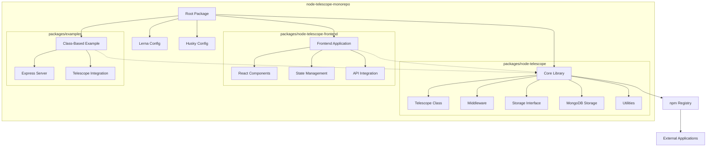

# Node-Telescope High-Level Design

This document outlines the high-level design of the Node-Telescope project.

For a detailed breakdown of the project's folder structure, please refer to the [Project Structure document](../project-structure.md).

## Architecture Diagram

## Components Description

1. **Root Package**: Represents the monorepo structure, managed by Lerna.
2. **Lerna Config**: Manages the monorepo and package relationships.
3. **Husky Config**: Handles git hooks for maintaining code quality.
4. **Core Library (node-telescope package)**:
   - Telescope Class: The main class that users interact with.
   - Middleware: Express middleware for capturing HTTP requests.
   - Storage Interface: Defines the contract for storage implementations.
   - MongoDB Storage: An implementation of the storage interface using MongoDB.
   - Utilities: Helper functions and shared code.
5. **Examples**:
   - Class-Based Example: Demonstrates how to use the library in a real application.
   - Express Server: A sample server setup.
   - Telescope Integration: Shows how to integrate node-telescope into an Express app.
6. **npm Registry**: Where the node-telescope package will be published.
7. **External Applications**: Represents potential users of the node-telescope package.

## Future Considerations

As the project evolves, we may update this diagram to include:
- Additional storage implementations
- More examples or use cases
- Frontend components for visualizing the collected data
- Integration with other services or tools
- New features or modules added to the core library